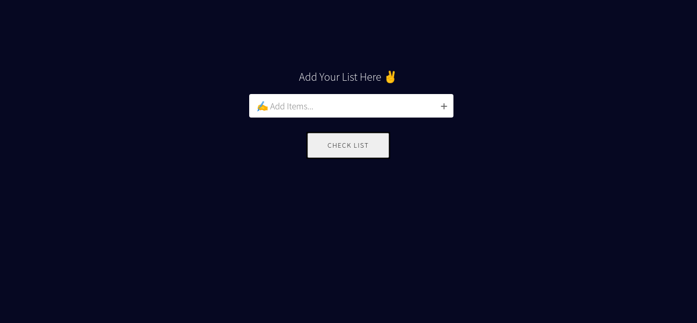
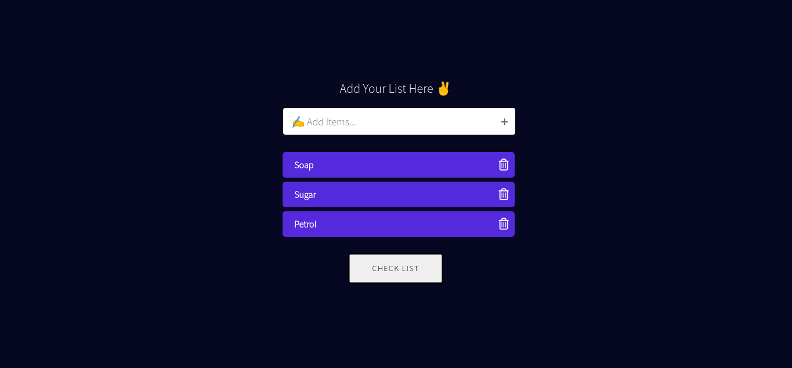

# To Do App

This is todo app built using Reactjs and redux.

## Demo

https://todo-skolap.web.app/

## Tech Stack

React, Redux, Firebase Hosting

## Features

- Add task
- Remove one task
- Remove all tasks

## Installation

- clone repo
- `npm install`
- `npm start`

## Authors

- Shailesh Kolap - [skolap](https://github.com/Skolap)

## Screenshots

  
  
 

<!-- 

 -->
